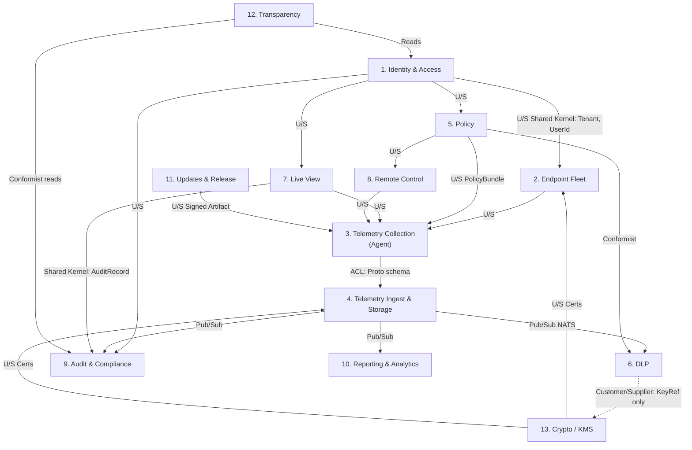

# Bounded Contexts — DDD Map

> Language: English. Method: Strategic DDD context mapping.

## Contexts

| # | Context | Core Aggregates | Team / Owner |
|---|---|---|---|
| 1 | **Identity & Access** | Tenant, User, Role, Session | Backend |
| 2 | **Endpoint Fleet** | Endpoint, EnrollmentToken, AgentVersion | Backend + Agent |
| 3 | **Telemetry Collection** | RawEvent, EventBatch, LocalQueueEntry | Agent |
| 4 | **Telemetry Ingest & Storage** | IngestSession, StoredEvent, AggregateRollup | Backend (data) |
| 5 | **Policy** | Policy, PolicyBundle, Assignment, Rule | Backend |
| 6 | **DLP (Data Loss Prevention)** | KeystrokeBlob, DLPRule, Match, Alert | Security |
| 7 | **Live View** | LiveViewRequest, Approval, Session, AuditEntry | Backend + Compliance |
| 8 | **Remote Control** | RestrictionCommand, BlocklistEntry | Backend |
| 9 | **Audit & Compliance** | AuditRecord, HashChainBlock, RetentionPolicy, **LegalHold**, **AuditCheckpoint** | Compliance |
| 10 | **Reporting & Analytics** | Report, Dashboard, ScheduledExport | Backend |
| 11 | **Updates & Release** | Release, CanaryCohort, Rollout | DevOps |
| 12 | **Transparency** | EmployeeNotice, ConsentRecord, DataRequest | Compliance |
| 13 | **Crypto / Key Management** | RootCA, IntermediateCA, DataKey, WrappedKey | Security |

## Mermaid — Context Map

Legend: U/S = Upstream/Downstream. ACL = Anti-Corruption Layer.

## Relationship Notes

- **Shared Kernel**: `TenantId`, `EndpointId`, `UserId`, `Timestamp` are defined once in `proto/personel/v1/common.proto` and shared across all contexts. Evolution of the shared kernel requires cross-team ADR.
- **Anti-Corruption Layer (Agent → Ingest)**: The gRPC proto schema is the ACL. The agent's internal Rust types are intentionally distinct from wire types; a translation layer prevents the agent's collector modules from coupling to storage concerns.
- **DLP → Crypto**: Customer/Supplier. DLP is the only consumer of keystroke decryption material. Crypto context exposes a narrow `UnwrapKey(keyRef)` RPC scoped to the DLP service identity. DLP never stores the unwrapped key; it re-unwraps per batch.
- **Live View → Audit**: Shared Kernel on `AuditRecord` structure. Live View cannot start a session without writing a block to the Audit chain first; this is enforced at the API layer via a transactional outbox.
- **Policy → DLP**: Conformist. DLP consumes the policy bundle format as-is; DLP team does not negotiate the schema. This keeps DLP simple.
- **Updates**: Upstream to Collection. The agent is a conformist consumer of the release artifact format.
- **Transparency**: Read-only conformist on Audit and Identity. It cannot mutate. KVKK data subject requests are filed here and fulfilled via Audit/Reporting.

## Cross-Cutting Concerns

Three concerns cut across multiple contexts and do not belong to any single one:

### DLP State Management (cross-cutting, owned by Platform Operations + Compliance + Security)

Introduced by **ADR 0013 — DLP Disabled by Default in Phase 1** (2026-04-11). DLP is not a runtime-always-on feature; it is a gated, opt-in feature whose state (`disabled` or `enabled`) is a first-class, auditable property of the deployment. The state spans four cooperating contexts and must remain coherent across all of them at all times.

- **Source of truth**: the backend state endpoint `GET /api/v1/system/dlp-state` exposed by **Identity & Access** / API layer. The endpoint cross-validates three underlying facts at every call: (a) whether a Vault AppRole Secret ID exists for `dlp-service`, (b) whether the `personel-dlp` container is healthy, and (c) the most recent `dlp.enabled | dlp.disabled` record in the **Audit & Compliance** hash chain. Any disagreement is reported as `state: mismatch` and triggers the `dlp_state_mismatch` Prometheus alert.
- **Writers**: exactly two — `infra/scripts/dlp-enable.sh` and `infra/scripts/dlp-disable.sh`. Both write the audit chain event, rotate the Vault Secret ID, and toggle the Compose profile in lock-step. No other component may write the state.
- **Policy wire contract**: the **Policy** context publishes `PolicyBundle.dlp_enabled` (see `proto/personel/v1/policy.proto`). Agents in **Telemetry Collection** consume it as an upstream/downstream relationship and refuse any bundle whose `dlp_enabled=false` but `keystroke.content_enabled=true` (structural invariant enforced by the policy signer before dispatch).
- **Consumers (read-only conformists)**:
  - **Telemetry Collection** (agent) — reads from the signed `PolicyBundle`; flips keystroke content collector off/on accordingly; zeroizes PE-DEK when transitioning to disabled.
  - **DLP** — does not start at all unless the Compose profile is active AND the Vault Secret ID is present; treats its own state as derived, never authoritative.
  - **Transparency** — surfaces the state as a banner on the employee Portal (`DLP aktif edildi: <tarih>` / `DLP kapalı`); also displays the historical timeline of state transitions.
  - **Admin Console** (part of Identity & Access presentation) — header badge (`DLP: Kapalı | Açık`), Settings → DLP panel, and the opt-in ceremony guidance flow.
  - **Reporting & Analytics** — any report that references DLP matches includes the deployment's DLP state timeline so that "no matches in period X" is correctly contextualised as "DLP was off in period X."
- **Compliance artifact**: the signed opt-in form (`docs/compliance/dlp-opt-in-form.md`, template to be authored by compliance-auditor) plus the corresponding `dlp.enabled` audit chain event plus the daily audit checkpoint plus the Transparency banner timestamp jointly form a **compliance artifact bundle** that strengthens the customer's KVKK m.10 / m.12 posture (see `docs/compliance/kvkk-framework.md` §10.5).

Invariant summary: install → no Secret ID → policy bundle `dlp_enabled=false` → agent content collector off → container not running → API state endpoint `disabled` → Console badge `Kapalı` → Portal banner `Kapalı`. A customer moving from "off" to "on" moves all seven in the same ceremony, atomically as far as the audit chain is concerned. A single drift between any two of these is a P1 incident.

### Legal Hold (cross-cutting, owned by Audit & Compliance)

Legal Hold is a flag state that can attach to records in **Telemetry Ingest & Storage** (events and blobs), **DLP** (matches), **Live View** (session and, in Phase 2, recordings), and **Reporting & Analytics** (scheduled exports). It freezes retention TTLs on those records for the duration of the hold. The authoritative model lives in **Audit & Compliance**; every other context consumes it as a read-only constraint via a shared `LegalHoldPredicate` at query/TTL evaluation time.

- **Placement / release**: only the **DPO** role in **Identity & Access**; every operation produces a hash-chained audit entry.
- **Scope**: narrow (endpoint + user + date range + event types); never tenant-wide.
- **Duration**: max 2 years; extensions require fresh justification.
- **Enforcement**: ClickHouse TTL clauses filter on `WHERE legal_hold = FALSE` via a materialized view; MinIO lifecycle honors object-level `x-amz-meta-legal-hold` metadata.
- See `docs/architecture/data-retention-matrix.md` §Legal Hold.

### Audit Chain Checkpoints (cross-cutting, owned by Audit & Compliance)

The append-only hash-chained audit log grows to millions of records over 5 years. O(n) full verification is impractical, so the Audit & Compliance context maintains **checkpoint records** that sign the current chain head on a daily cadence with the control-plane signing key, plus an external append-only sink. Every other context consumes checkpoints as proof-of-integrity; nothing else writes them.

- See `docs/architecture/audit-chain-checkpoints.md`.
- See `docs/security/runbooks/admin-audit-immutability.md`.

## Context Ownership for Downstream Agents

| Specialist Agent | Owns |
|---|---|
| rust-engineer | 2 (agent parts), 3 |
| backend-developer | 1, 2, 4, 5, 8, 10 |
| security-engineer | 6, 13, 9 (co-owner) |
| compliance-auditor | 9, 12 |
| devops-engineer | 11 |
| nextjs-developer | Consoles for all contexts |
| postgres-pro | Storage for 1, 2, 5, 7, 9 |
| ml-engineer | 10 (Phase 2: anomaly) |
