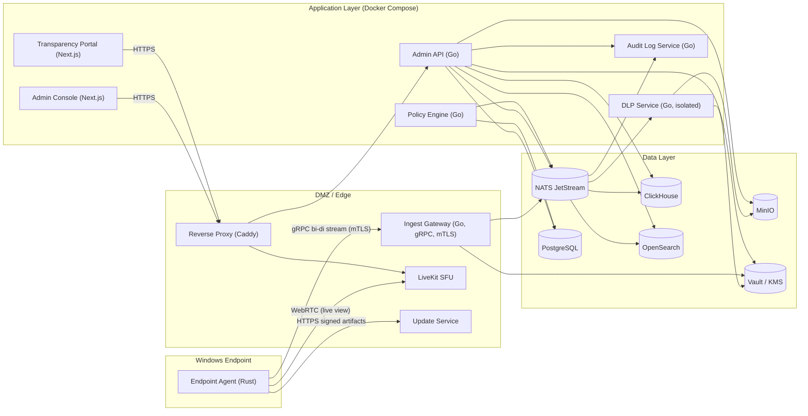

# C4 Level 2 — Container Diagram

> Language: English. Scope: Phase 1 on-prem deployment.

## Containers

| Container | Technology | Responsibility |
|---|---|---|
| **Endpoint Agent** | Rust 1.80+, tokio | Collection, local encrypted SQLite queue, policy enforcement, live-view producer, auto-update |
| **Ingest Gateway** | Go 1.22, gRPC, mTLS | Accept bidirectional stream from agents, validate, fan-out to NATS |
| **Admin API** | Go 1.22, HTTP/JSON + gRPC (internal) | Tenant, user, endpoint, policy CRUD; query orchestration |
| **Admin Console** | Next.js 14 App Router | Web UI for admins, HR, DPO |
| **Transparency Portal** | Next.js 14 | Employee-facing consent and notification |
| **DLP Service** | Go (isolated host/process) | Sole holder of keystroke decryption keys when enabled; pattern matching; emits match metadata only. **Disabled by default per ADR 0013.** Defined behind Compose profile `dlp`; not started by default `docker compose up`; Vault AppRole Secret ID is not issued at install time. Activated only via `infra/scripts/dlp-enable.sh` after the customer completes the signed opt-in ceremony. The state is reflected in `GET /api/v1/system/dlp-state`, the Console header badge, and the Transparency Portal banner. |
| **Policy Engine** | Go | Compiles tenant policies to per-endpoint bundles; pushes via gRPC |
| **Live View Broker** | LiveKit (SFU) | WebRTC signaling + SFU for screen streams |
| **Update Service** | Go | Serves signed agent artifacts, canary routing |
| **Audit Log Service** | Go | Append-only hash-chained audit journal (live-view, policy changes, admin actions) |
| **Event Bus** | NATS JetStream | Durable event stream between gateway, writers, DLP, alerting |
| **Time-Series Store** | ClickHouse | Hot/warm event store, aggregations |
| **Metadata Store** | PostgreSQL 16 | Tenants, users, endpoints, policies, audit pointers |
| **Object Store** | MinIO (S3) | Screenshots, video clips, encrypted keystroke blobs |
| **Search** | OpenSearch | Full-text over window titles, URLs, file paths, audit |
| **Secrets / PKI / KMS** | HashiCorp Vault | Root/intermediate CAs, key hierarchy, token issuance |
| **Reverse Proxy** | Caddy or nginx | TLS termination for console/portal/API |

## Mermaid — C4 Container

## Notable Placement Rules

- **DLP Service** is **off by default** (ADR 0013). When enabled via the opt-in ceremony, it runs on a dedicated host (Profile 2) or at minimum a separate container with its own Vault AppRole (Profile 1). In either state, Admin API has **no** network path that returns decrypted keystroke content; in the default-off state, no decryption path exists at all because no Secret ID has been issued.
- **Gateway** is the only component that terminates agent mTLS; all other services speak plaintext within the internal Docker network (which is itself protected by host firewalls and is not exposed).
- **Vault** stores root CA offline (air-gapped signing for intermediate); only intermediate CA runs online.
- **LiveKit** is reached by the agent via a second egress channel — WebRTC signaling is multiplexed but the media path is direct agent→SFU.
- **Audit Log Service** is append-only; no delete API exists, even for admins.

## Data Flows (Summary)

1. **Telemetry**: Agent → Gateway → NATS → { ClickHouse writer, DLP, OpenSearch indexer, Audit if admin-relevant }.
2. **Policy push**: Admin → API → Policy Engine → NATS subject `policy.v1.<tenant>.<endpoint>` → Gateway → Agent (on its bi-di stream).
3. **Live view**: Admin requests → API writes `live_view_requests` → HR approval → Audit log → API issues short-lived LiveKit token → Agent receives live-view control message on existing stream → Agent joins LiveKit room → Admin Console joins room.
4. **Update**: Release pipeline signs artifact → Update Service → Canary cohort → Rollout → Agent verifies signature → Staged restart.
