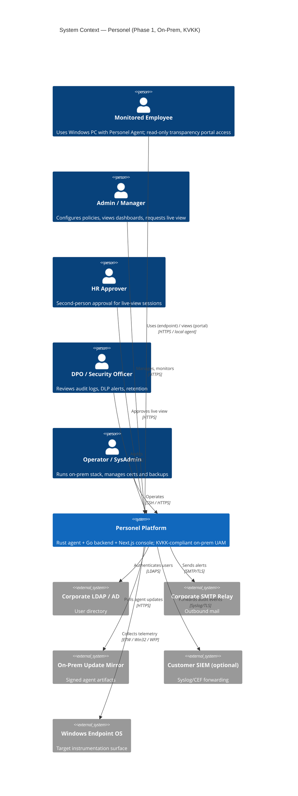

# C4 Level 1 — System Context

> Language: English. Audience: engineering, architects, onboarding.

## Purpose

Shows Personel as a single black box and the external actors and systems it interacts with. Scope is Phase 1 (on-prem, Windows-only agent, KVKK jurisdiction).

## Actors

| Actor | Role |
|---|---|
| **Monitored Employee** | End user whose Windows endpoint runs the Personel Agent. Has read-only access to the Transparency Portal. |
| **Admin / Manager** | Uses the Admin Console to configure policies, view reports, initiate live-view requests. |
| **HR Approver** | Second-person authorizer required to approve live-view sessions before they can start. Distinct role from Admin. |
| **Security Officer / DPO** | Reviews audit logs, DLP alerts, manages retention. Holds KVKK/VERBİS responsibility. |
| **Operator / SysAdmin** | Runs the on-prem stack (Docker Compose, systemd). Manages backups, certificate rotation. |

## External Systems

| System | Interaction |
|---|---|
| **Corporate Identity Provider (LDAP/AD)** | Personel API authenticates Admin, HR, DPO users against LDAP/AD (Phase 1). SAML/OIDC is Phase 2. |
| **Corporate SMTP Relay** | Personel sends operational alerts (policy changes, DLP hits above threshold, audit summaries). |
| **Update Distribution Mirror (on-prem)** | Signed agent artifacts are served from an on-prem mirror populated by the Personel release pipeline. |
| **Customer SIEM (optional)** | Audit and security events can be forwarded via syslog/CEF. |
| **Windows Endpoint OS** | Target of the Rust agent: ETW, Win32, WFP user-mode, DXGI capture. |

## Mermaid — C4 Context

## Trust Boundaries

1. **Endpoint ↔ Gateway** — mTLS, certificate pinning, per-endpoint client cert.
2. **Admin ↔ API** — Session cookie + CSRF, LDAP-backed auth, role-based policy.
3. **DLP service** — Isolated process trust boundary; no inbound admin access; only signed RPC from gateway and policy engine.
4. **Operator / host** — Out-of-band; trusted but audited via systemd journal + file integrity monitoring.
