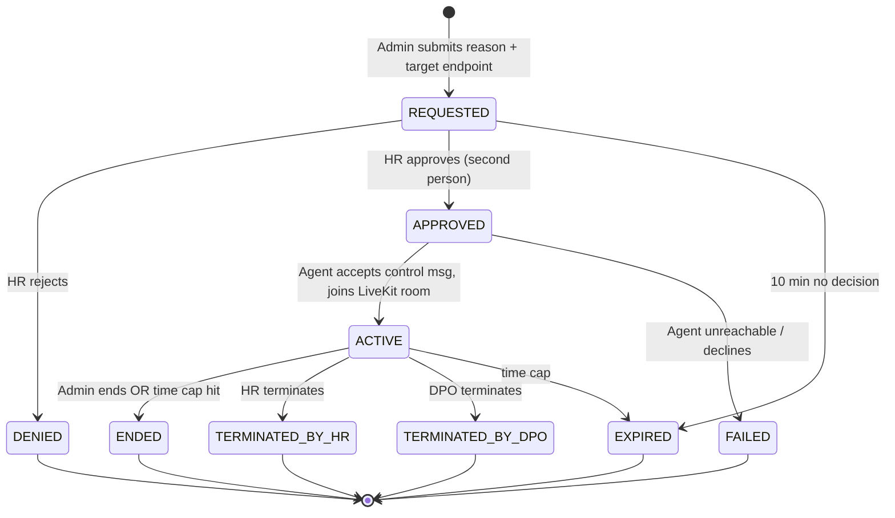
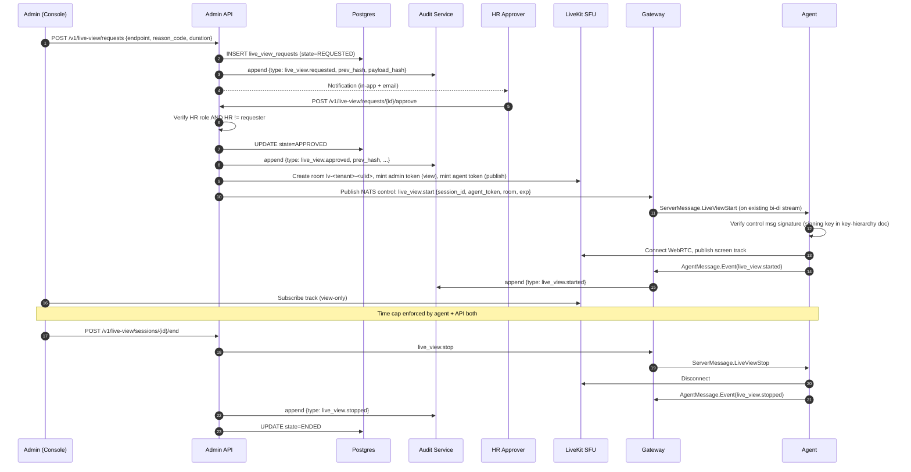

# Live View Protocol

> Language: English. Scope: Phase 1. Enforces Decision 5: one-time install notice, mandatory HR approval gate, hash-chained audit, silent-after-notice.

## Principles

1. **Transparency once**: the employee is informed at installation that live view is possible. After that, no in-session indicator is presented.
2. **Dual control**: every live-view session requires a **requester** (Admin/Manager) AND an **approver** (HR role) — same-person approval is rejected.
3. **Auditable**: every state transition is appended to a hash-chained log; tampering is detectable.
4. **Time-boxed**: sessions are capped (default 15 minutes, max 60). Extension requires a new approval.
5. **Reason-bound**: every request carries a reason code (ticket id, incident id, investigation id). No free-text-only.
6. **Revocable**: HR can terminate any live session. The DPO can terminate any live session.

## State Machine

States: `REQUESTED → APPROVED → ACTIVE → (ENDED | TERMINATED_BY_HR | TERMINATED_BY_DPO | EXPIRED | DENIED | FAILED)`



## Sequence



## Audit Hash Chain

Append-only table `audit_records`:

```
id           bigint primary key
tenant_id    uuid
seq          bigint (monotonic per tenant, enforced by unique index)
type         text
actor_id     uuid null
subject_id   uuid null (endpoint / session)
payload_json jsonb
payload_hash bytea   -- sha256(canonical_json(payload))
prev_hash    bytea   -- hash of previous record's (seq || payload_hash || prev_hash)
this_hash    bytea   -- sha256(seq || payload_hash || prev_hash)
created_at   timestamptz
```

- Insert is performed inside a transaction that `SELECT ... FOR UPDATE` on the previous record to prevent races.
- `this_hash` is verified by a nightly job across all tenants; any break alerts immediately.
- Retention: 5 years minimum (see `data-retention-matrix.md`).
- There is **no** DELETE or UPDATE API. The database role used by `audit-service` is granted `INSERT, SELECT` only.

## Employee Notification Semantics

- **At install time**: The installer shows a one-time dialog that cannot be dismissed without acknowledging. The Transparency Portal shows a permanent "Canlı izleme mümkündür" section with the relevant policy text, the approvers' roles, and how to file a KVKK m.11 request.
- **During a session**: No on-screen indicator. No tray icon change. No mouse cursor change. (This is the design requirement; legal responsibility for the one-time disclosure's adequacy rests on the customer DPO, not on Personel.)
- **After a session**: The Transparency Portal shows the monitored employee a historical list of live-view sessions that targeted them. **Default: ON** (changed during Phase 0 compliance review for KVKK accountability — the employee should be able to see when they were monitored). Each row shows: session id, date/time, duration, requester role (not name), approver role (not name), reason code category (not free text). The customer DPO may switch this OFF only with a written justification that is appended to the audit chain as a separate `transparency.history_visibility_changed` entry; any such change is itself shown in the DPO dashboard and to the affected employees as a one-time portal notice ("visibility of your monitoring history has been restricted on <date>"). No silent disable is possible.

## LiveKit Token Design

- Admin token: `view` grants, room-scoped, 15 min TTL, cannot publish.
- Agent token: `publish` grants, room-scoped, TTL matches session cap, includes a `session_id` claim.
- Tokens are minted by Admin API only after state transition to `APPROVED`. Any join to a room without a valid short-lived token is rejected by LiveKit.

## Termination Guarantees

- **Time cap** enforced in three places: LiveKit token exp, agent-side timer, API-side timer. Any one can end the session.
- **Tamper**: If the agent detects its control channel is lost mid-session, it terminates the LiveKit publish within 2 s.
- **HR/DPO kill switch**: Either can issue `POST /v1/live-view/sessions/{id}/terminate` which revokes LiveKit tokens, sends stop control, and audits.

## Failure Modes

| Failure | Handling |
|---|---|
| Agent offline | Request stays APPROVED for 60 s; then FAILED. Audited. |
| Agent declines signature check | FAILED + `agent.tamper_detected` |
| LiveKit room create error | FAILED; request rolled back to REQUESTED-with-error (operator action needed) |
| Network drop mid-session | ENDED with reason `network_drop` |
| HR terminates mid-session | TERMINATED_BY_HR |

## Phase 2 Recording — Future Design Note (Informative)

> Status: **Accepted for Phase 2, Out of Scope for Phase 1.** See `docs/adr/0012-live-view-recording-phase2.md`. This section is advisory so that Phase 1 decisions (audit chain shape, key hierarchy, proto fields) do not paint Phase 2 into a corner.

Recording live-view sessions is a high-risk feature. Phase 2 will introduce it under the following constraints:

1. **Default OFF**, tenant-wide. Enabling it is an affirmative DPO action, logged in the audit chain.
2. **Independent key hierarchy** — recordings are encrypted under a new **Live-View Master Key (LVMK)** that is **not** TMK and has **no** relationship to the keystroke key hierarchy. This keeps cryptographic blast radius contained: a compromise of the live-view subsystem cannot leak keystroke content and vice versa.
3. **Per-session DEK**: each recorded session is encrypted with a fresh per-session AES-256-GCM data key, which is wrapped by LVMK (Vault transit). The wrap is stored in Postgres `live_view_recordings(session_id, wrapped_dek, lvmk_version, created_at)`.
4. **Retention**: 30 days default, legal-hold eligible. After expiry, the per-session wrapped DEK is destroyed first, then the ciphertext blob in MinIO is lifecycle-deleted — matching the keystroke destruction pattern.
5. **Playback requires the same dual control as initiation**: an Admin must request playback, an HR Approver must approve, playback is itself audited as a distinct entry type `live_view.playback_requested|approved|started|ended`.
6. **DPO-only export**: only the DPO role can export a recording for forensic purposes. Export is append-audited with a mandatory reason code, produces a watermarked file, and is visible to the employee in the Transparency Portal session history.
7. **Audit chain referencing**: the audit entry for a recorded session will include `recording_blob_ref` and `lvmk_wrap_ref`. In Phase 1 these fields are reserved on the proto but MUST remain empty; any Phase 1 code that populates them is a bug.
8. **No "download MP4" button**; no bulk export; no browser-side caching beyond the playback buffer.

Anything that conflicts with the above is out-of-scope and must be re-approved via new ADR at Phase 2 kickoff.

## Out-of-Scope (Phase 1)

- Recording live sessions to disk (Phase 2 per design note above; see ADR 0012).
- Multi-viewer sessions (Phase 2).
- Two-way audio (never — live view is screen only).
- Pointer/keyboard handover during live view (remote control is a separate feature with its own approval flow).
