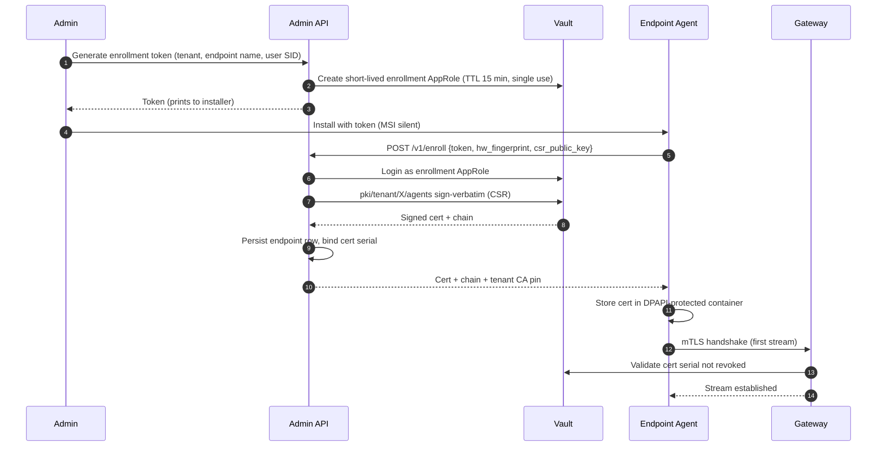

# mTLS and PKI Architecture

> Language: English. Scope: certificate chain for agent↔gateway and inter-service TLS. Crypto material for keystroke content encryption lives in `key-hierarchy.md` and is a separate hierarchy.

## Goals

1. Every agent authenticates to the gateway with a unique X.509 client certificate.
2. Every server component presents a certificate validated by the agent via **certificate pinning** (pin the tenant CA).
3. Rotation is automatic and does not require touching endpoints manually.
4. Compromised agents can be revoked within **≤ 5 minutes** enterprise-wide.
5. Root CA key is **offline** (air-gapped / HSM-backed). Only the intermediate CA is online.

## Certificate Hierarchy

```
Personel Root CA (offline, HSM / air-gapped)
└── Tenant CA (online, Vault PKI secrets engine, 5y validity)
    ├── Agent Intermediate CA (Vault, 2y)
    │   └── Agent Client Cert (per endpoint, 14d validity, auto-renew — see ADR 0011)
    └── Server Intermediate CA (Vault, 2y)
        ├── Gateway Server Cert (90d, auto-renew)
        ├── Admin API Server Cert (90d)
        ├── Live View SFU Server Cert (90d)
        ├── Update Service Server Cert (90d)
        └── DLP Service Server Cert (90d)
```

## Vault Layout

- `pki/root` — root CA (offline signing only; mounted only during intermediate issuance ceremonies).
- `pki/tenant/<tenant_id>` — tenant CA.
- `pki/tenant/<tenant_id>/agents` — agent intermediate.
- `pki/tenant/<tenant_id>/servers` — server intermediate.
- Each role has strict allowed CN/SAN templates and short TTLs.

## Agent Enrollment (Bootstrap)



Key points:
- The CSR private key is generated **on the endpoint**; the private key never leaves the host.
- The tenant CA public cert (pin) is embedded in the installer **and** re-delivered post-enrollment so the agent can verify chain independently.
- Hardware fingerprint (TPM-bound where available, otherwise stable machine GUID) is recorded on the endpoint row to detect cert replay on a different host.

## Rotation

| Cert | Validity | Rotation | Trigger |
|---|---|---|---|
| Root CA | 20 y | Manual ceremony | End of life |
| Tenant CA | 5 y | Manual ceremony | End of life |
| Agent/Server Intermediates | 2 y | Automated, staged | 6 months before expiry |
| Agent Client Cert | **14 d** | Automated on-stream | 3 days before expiry |
| Server Certs | 90 d | Automated (consul-template / vault-agent) | 14 days before expiry |

Agent rotation flow: on the existing gRPC stream, the agent receives a `ServerMessage.RotateCert` directive, submits a fresh CSR, and the gateway returns the signed cert inline. No downtime, no manual steps.

## Revocation

Two-layer revocation:

1. **OCSP stapling** at the gateway — fast path. Vault PKI generates OCSP responses; gateway caches and staples.
2. **Short-lived certs** — 14-day agent certs and 90-day server certs limit the window regardless of OCSP. The 14-day figure was tightened from an initial 30-day draft after security-engineer review (see `docs/security/runbooks/pki-bootstrap.md` §7 and ADR 0011). Rationale: rotation is effectively free on the always-connected bidirectional gRPC stream (`ServerMessage.RotateCert`), and 14 days halves the worst-case offline revocation window versus 30 days.
3. **Deny list cache** — gateway maintains an in-memory deny list keyed by cert serial, populated by Admin API events on NATS subject `pki.v1.revoke`. Propagation target: ≤ 5 minutes cluster-wide.
4. **CRL** — published hourly as a fallback for offline validation (e.g., audit review).

## Certificate Pinning on the Agent

The agent pins the **tenant CA SPKI SHA-256**, not a leaf server cert. Pin values:

- Compiled into the agent binary for the factory tenant.
- Updated during enrollment for the actual target tenant.
- Rotated via a signed `PinUpdate` control message (covered by the key hierarchy's signing root; any unsigned pin-update is rejected).

Pin mismatch → agent refuses to connect, logs `agent.tamper_detected` to local queue, enters backoff, and resumes only when chain validates.

## Key Storage on the Endpoint

- Agent private key: Windows DPAPI (machine scope) → sealed to a TPM-bound protector where available.
- Tenant CA public pin: read-only, integrity-checked at each startup.
- Rotation creates a new DPAPI-protected blob atomically and swaps.

## Operational Runbook Hooks

- `vault-agent` sidecar watches certificate leases and writes renewed certs to named volumes consumed by Go services.
- systemd unit `personel-vault-agent.service` is a prerequisite for `personel-gateway.service`.
- Cert expiry alerts fire at T-21 days, T-14 days, T-7 days to pager.
- Root CA ceremonies documented in `docs/runbooks/root-ca-ceremony.md` (to be authored by DevOps specialist agent).
