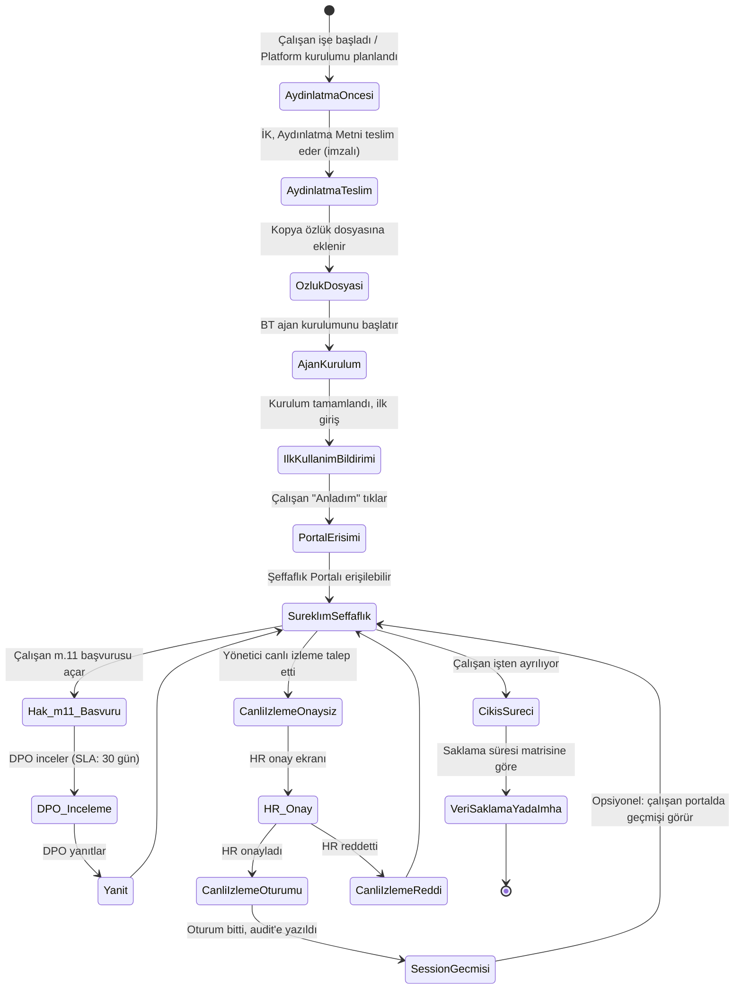

# Çalışan Bilgilendirme ve Şeffaflık Akışı

> Kapsam: Personel Platformu'nun konuşlandığı müşteri kurumlarda, çalışanın ilk temastan itibaren tüm bilgilendirme ve şeffaflık noktalarının durum makinesi.
> Hukuki dayanak: KVKK m.10 (aydınlatma yükümlülüğü), m.11 (veri sahibi hakları), m.4 (dürüstlük, şeffaflık).

## 1. Durum Makinesi

## 2. Aşama Detayları

### Aşama 1 — Aydınlatma Öncesi (T-N gün)
- **Tetikleyici**: Yeni işe alım veya mevcut kuruma Platform kurulumu
- **Sorumlu**: İK
- **Aksiyon**: Aydınlatma Metni hazırlığı, çalışan listesinin oluşturulması
- **UI**: Yok (arka ofis)

### Aşama 2 — Aydınlatma Teslimi (T-0)
- **Tetikleyici**: Ajan kurulumundan önce
- **Sorumlu**: İK + çalışan
- **Aksiyon**: Aydınlatma Metni (bkz. `aydinlatma-metni-template.md`) çalışana teslim, imzalı kopya alınır
- **UI**: Offline + İK portalı
- **KVKK madde**: m.10 (aydınlatma yükümlülüğü yerine getirilmiş sayılır)

### Aşama 3 — Özlük Dosyasına Ekleme (T+0)
- **Sorumlu**: İK
- **Aksiyon**: İmzalı aydınlatma metni özlük dosyasına eklenir
- **Delil**: Mahkemede aydınlatma yapıldığının ispatı
- **UI**: İK iç sistemi

### Aşama 4 — Ajan Kurulumu (T+0...T+1)
- **Sorumlu**: BT
- **Aksiyon**: Rust ajan yüklenir, mTLS enrollment
- **UI**: Yok (arka ofis); kullanıcıya görünmez

### Aşama 5 — İlk Kullanım Bildirimi (T+1, ilk giriş)
- **Tetikleyici**: Çalışanın kurulum sonrası ilk Windows girişi
- **Aksiyon**: Tam ekran modal dialog: "Bu bilgisayar [{Şirket}] bilgi güvenliği kapsamında Personel platformu ile izlenmektedir. Detaylar için lütfen Aydınlatma Metni'ni okuyun. Canlı ekran izleme özelliği vardır."
- **Zorunluluk**: "Anladım" düğmesi tıklanmadan dismiss edilemez
- **Delil**: Tıklama eventi audit log'a yazılır
- **UI**: Agent tam ekran overlay
- **Kaynak**: `docs/architecture/live-view-protocol.md` → "Employee Notification Semantics"

### Aşama 6 — Şeffaflık Portalı Sürekli Erişim (T+1 sonrası)
- **Aksiyon**: Çalışan her an portal üzerinden aşağıdakilere erişir:
  - Kendi aydınlatma metni
  - Veri kategorileri ve saklama süreleri
  - "Verilerim" özet ekranı (hangi tür kaydın tutulduğu)
  - m.11 başvuru formu
  - Canlı izleme politikası açıklaması
  - **Canlı izleme oturum geçmişi (varsayılan AÇIK — KVKK hesap verebilirlik ilkesi gereği)**. Müşteri DPO'su bu özelliği yalnızca yazılı gerekçe ile ve audit log'a işlenen bir kararla kapatabilir. Kaynak: `docs/architecture/live-view-protocol.md` — "Employee Notification Semantics" (Faz 0 revision round 1'de AÇIK varsayılanına güncellendi).
- **UI**: Next.js Transparency Portal
- **KVKK madde**: m.4 (şeffaflık), m.11 (hak kullanımı)

### Aşama 7 — m.11 Başvurusu Akışı
- **Tetikleyici**: Çalışan portalda form doldurur
- **Aksiyon**:
  1. Başvuru kaydı, DPO'ya e-posta + dashboard bildirimi
  2. SLA sayacı başlar (30 gün)
  3. DPO inceler: kimlik doğrulama, meşru menfaat dengesi (silme talebi ise), yasal saklama çakışması
  4. DPO yanıtlar: portal üzerinden + e-posta
  5. Çalışan yanıtı görür; memnun değilse Kurul'a başvurabileceği bilgisi metinde yer alır
- **UI**: Portal + Admin Console DPO rolü
- **KVKK madde**: m.11, m.13

### Aşama 8 — Canlı İzleme Akışı (ilgili çalışan için olursa)
- **Tetikleyici**: Yönetici soruşturma amacıyla talep açar
- **Aksiyon (bkz. `live-view-protocol.md` sequence diagram)**:
  1. Admin Console'da talep açılır (endpoint + reason_code + süre)
  2. HR rolüne bildirim gider
  3. HR onaylar (approver ≠ requester kontrolü server-side)
  4. Agent LiveKit'e bağlanır
  5. Oturum max 15 dk (uzatma için yeni onay)
  6. DPO veya HR her an sonlandırabilir
  7. Oturum sonu audit'e yazılır
  8. Çalışan portalda (opsiyonel) geçmiş listesinde görür
- **UI**: Admin Console (yönetici) + HR Approval Screen + Transparency Portal (geçmiş, opsiyonel)
- **Delil zinciri**: Hash-zincirli audit, 5 yıl saklanır

### Aşama 9 — Çıkış Süreci
- **Tetikleyici**: Çalışan işten ayrılıyor
- **Aksiyon**:
  - Ajan kaldırılır (operatör script)
  - Mevcut veriler saklama matrisine göre kalmaya devam eder
  - Çalışanın çıkış sonrası m.11 hak kullanımı yine mümkündür (genel iletişim kanalı üzerinden)
- **UI**: İK + BT iç süreci

## 3. UI Bileşeni Eşlemesi

| Bilgilendirme Noktası | UI Bileşeni | Kaynak Modül |
|---|---|---|
| Aydınlatma metni teslimi | Offline / İK portalı | İK sorumluluğu |
| İlk kurulum modal | Agent tam ekran overlay | Rust agent |
| Sürekli aydınlatma | Transparency Portal "/aydinlatma" | Next.js Portal |
| Veri kategorileri | Transparency Portal "/verilerim" | Next.js Portal |
| m.11 başvuru formu | Transparency Portal "/haklar" | Next.js Portal |
| Canlı izleme politikası | Transparency Portal "/canli-izleme" | Next.js Portal |
| Canlı izleme oturum geçmişi (opsiyonel) | Transparency Portal "/oturum-gecmisi" | Next.js Portal + Admin API |
| HR onay ekranı | Admin Console HR rolü | Next.js Admin Console |
| DPO başvuru dashboard | Admin Console DPO rolü | Next.js Admin Console |
| Audit görüntüleyici | Admin Console DPO+Auditor rolü | Next.js Admin Console |

## 4. Teslimat Kanıt Matrisi (Mahkemede Kullanıma Yönelik)

| Kanıt | Nerede Saklanır | Ne İspatlar |
|---|---|---|
| İmzalı Aydınlatma Metni | İK özlük dosyası | m.10 aydınlatma yapıldı |
| İlk kullanım "Anladım" tıklaması | Hash-zincirli audit log | Çalışan bilgilendirildi ve onayladı |
| Portal aktif erişim log'u | PostgreSQL + audit | Sürekli şeffaflık sağlandı |
| Canlı izleme onay zinciri | Hash-zincirli audit | Dual control uygulandı |
| DLP kural değişiklik audit | Audit log | Kural kötüye kullanılmadı |
| 6 aylık periyodik imha raporu | DPO arşivi | Saklama sürelerine uyuldu |
| DPIA | DPO arşivi | Risk değerlendirmesi yapıldı |
| VERBİS kaydı | Kurul VERBİS | Kayıt yükümlülüğü yerine getirildi |
